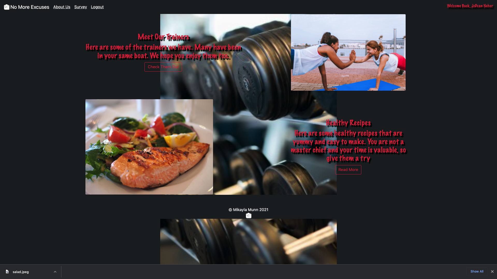
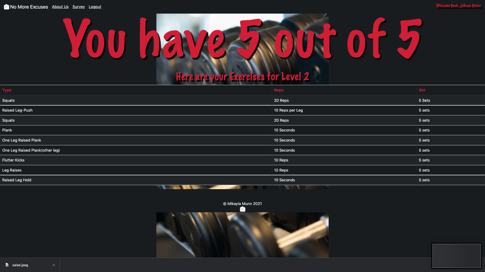

# No Excuse Gym
No Excuse Gym is a website designed to allow the user to find  and maintain weight loss.
## Install
___
 Please open a floating terminal to install mongo.  Below copy the address and install in the floating terminal<br>
 Also, there are TWO different zip files because my files alone were too big, please make sure you have both files
  ```/usr/local/mongodb/bin/mongod --dbpath ~/.mongo```

  ### Installing in the Client Folder
   Please Open the VS Code, once you are in please press <br> CMD (command) ```~``` (tilda). Then a terminal should pop up, inside the terminal please type CD (Change Directory) client 
   ```cd client```. Please type in ```npm install``` to use the required libraries, if that does not work, please install the following:
 > - Axios <br>
```npm install axios```
> - Bootstrap <br>
 ```npm install bootstrap```
 > - COA <br>
```npm install coa```
 > - React <br>
```npm install react```
 > - React-Bootstrap <br>
```npm install react-bootstrap```
 > - React-DOM <br>
```npm install react-dom```
 > - React-Router-DOM <br>
```npm install react-router-dom```
 > - React-Scripts <br>
```npm install react-scripts```
In order to to start client after installing dependencies enter npm start in the client directory
  ### Installing in the Server Folder
   Please Open the VS Code, once you are in please press CMD (command) ```~``` (tilda). Then in another terminal, inside the terminal please type CD (Change Directory) server
   ```cd server```. Please type in ```npm install``` to use the required libraries, if that does not work, please install the following:
 > - Body-Parser <br>
```npm install body-parser```
> - CORS <br>
 ```npm install cors```
 > - Express <br>
```npm install express```
 > - Mongoose <br>
```npm install mongoose```
 > - Path <br>
```npm install path```
 > - Nodemon <br>
```npm install nodemon```
In order to to start server after installing dependencies enter npm start in the server directory
## Description
___
This website contains users and trainers. Each user has a personal page, can take a survey, and can view trainers. The trainers can sign up, however the admin must approve them.

## Opening Page
---
This is the welcoming page states Plenty of Excuses with a subtitle of Mind. Body. & Spirit. It has a register button for the user to click on and it will lead them to the register page. If they are already a member, the user can login.  If the user tries to login, but the user is NOT a member. A message will pop up stating "We're Sorry, you do not have an account!" with a link to register. Once the user, logins/registers successfully, they will get a Welcome message. In addition, once signed in the user's name will display in the upper right-hand corner.

## User Home Page
---

On the users Personal Homepage, the user can click a button to view more information about our trainers. They can also click to find a recipe for them to make that will pop up in a modal. 

## About Us
---
 On the Navigation Bar, located at the top of the page. The user can navigate to different areas of the website. The About Us section, allows the users to see the trainers that are available. They can click on the send a text message button and a modal will pop up with the trainers name and phone number.

 ## Survey
 ---

 On the Survey page, the user can answer a few questions to see where they are at in their fitness level. Based on their results, the user will receive a series of exercises to do, in a chart for them to do.

 ## Logout
 ---
 If the user logs out, the navigation bar will change back to the original homepage and the user's name will no longer be displayed in the upper right-hand corner.

 # ADMIN LOGIN
 ___
 ## Footer Access Login
 ---
 In the footer, the scale that is underneath 'Mikayla Munn 2021' is the access point for the admin page. Once clicked the admin login infromation is: <br/>
 ```Name: Mik``` <br/>
 ```Password: 123```<br/>
 Once you login,  in the upper right you get a message that says welcome back. On the main page, the admin has two options. View Trainers will take the admin to see the trainers available. The trainers are a cards, with their name, degree, and about them section. 
 <br>
 On top of the page, displayed is we currently have (the number of trainers/users). The admin also has access to delete the trainer. If the admin clicks the button a window comfirm are you sure message will pop up. There is also a button below the trainers displayed that will take the admin view the user. 
 <br>
The user's are displayed the same way as the trainers, they are on cards with user name, phone number, and password (just in case they forget in future use the admin could send them that information).  There is also a delete option as well. Once clicked, a window.comfirm will pop up stating are you sure you want to do this.
 
 ### Roadmap
___

>- I would like to add additional databases and logins for Mind and Spirit aspects. 
>- Different Navigation Bars depending on the views
>- More recipes and exercises for the user to do
>- A Calendar to added to the user, trainer and other additional logins for scheduling purposes

 ### Support
___
If you are struggling please contact Mikayla Munn at <br>email address: *mpmunn2016@gmail.com* for some assistance.

 ### Authors and acknowledgement
___
A special thanks to the following people:
>- Chelsia Spaulding
>- Teré McCall
>- Mikayla Munn
>- JoDean Neher
>- Surekha W
>- Oscar C
>- And everyone else in the MERN class at IWP 
Thank you for your patience and help in creating this app, without your ideas I would not have had this much success.
 ### License
[MIT](https://choosealicense.com/licenses/mit/)